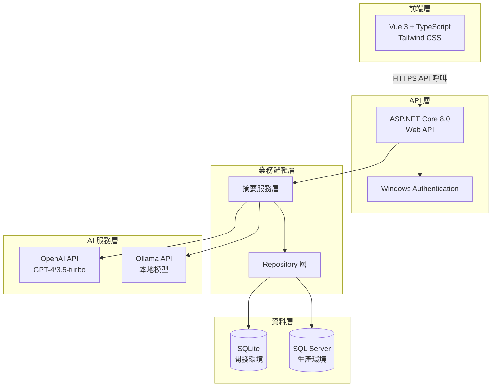
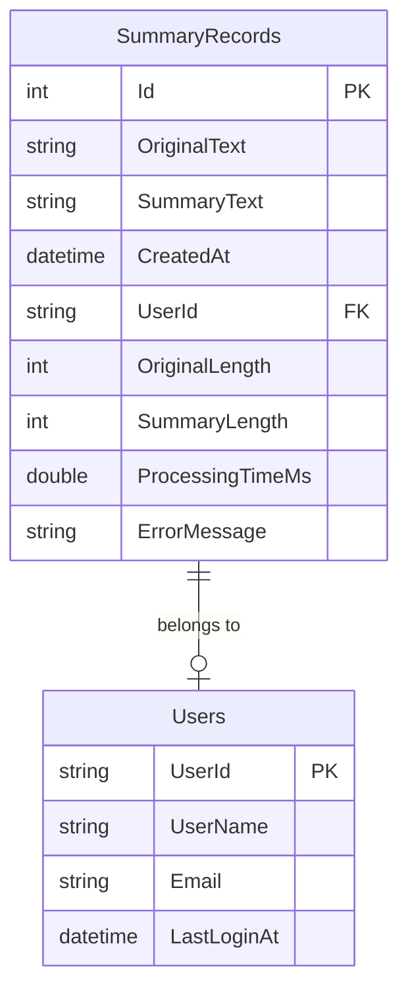
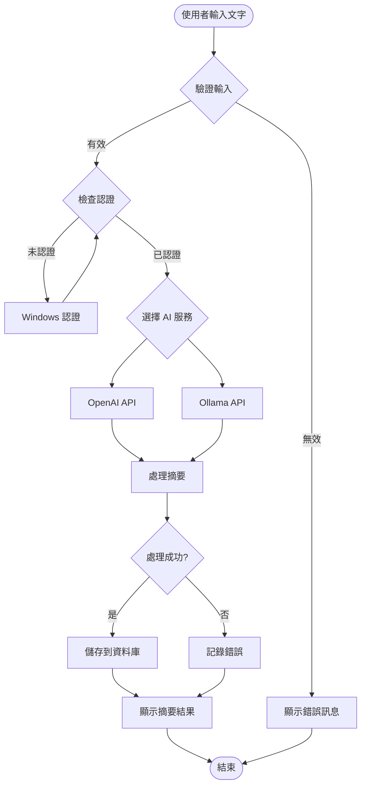
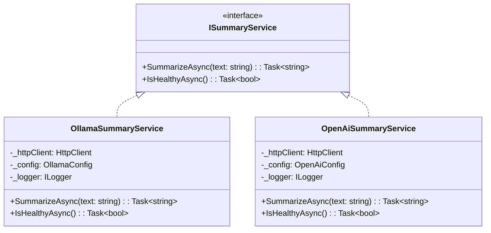
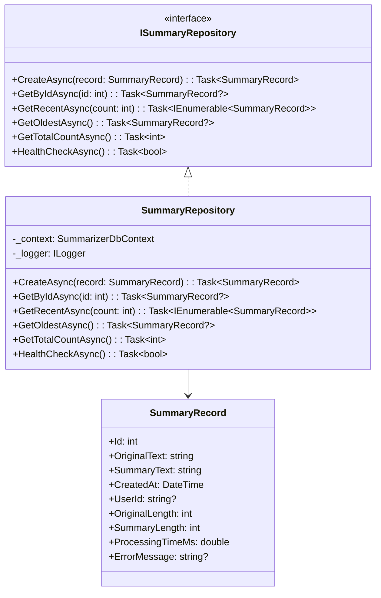

# AI 總結助手 (Summarizer)

企業級 AI 文件摘要系統，支援 OpenAI 和 Ollama API，提供安全、高效的文件摘要服務。

## 📋 專案概述

AI 總結助手是一個現代化的全端 Web 應用程式，專為企業內部使用而設計。系統整合了多種 AI 服務，提供智慧文件摘要功能，並具備完整的資料持久化和使用者認證機制。

### ✨ 主要功能

- 🤖 **多 AI 引擎支援**: 支援 OpenAI GPT 和 Ollama 本地部署模型
- 🔐 **Windows 整合認證**: 無縫企業環境整合
- 💾 **資料持久化**: 自動儲存摘要記錄供後續查詢
- 🎨 **現代化 UI**: 基於 Vue 3 + Tailwind CSS 的響應式介面
- 📊 **資料分析**: 提供摘要統計和使用分析
- 🛡️ **安全性**: 企業級安全性設計

## 🏗️ 技術架構

### 系統架構圖



### 資料庫關係圖



### 系統流程圖



## 🛠️ 技術棧

### 後端技術

| 技術 | 版本 | 用途 |
|------|------|------|
| .NET | 8.0 | 核心框架 |
| ASP.NET Core | 8.0 | Web API 框架 |
| Entity Framework Core | 8.0 | ORM 資料存取 |
| SQLite | 3.x | 開發資料庫 |
| SQL Server Express | 2022 | 生產資料庫 |
| Serilog | 8.0 | 結構化日誌 |

### 前端技術

| 技術 | 版本 | 用途 |
|------|------|------|
| Vue.js | 3.5.13 | 前端框架 |
| TypeScript | 5.x | 靜態類型 |
| Vite | 6.1.0 | 建置工具 |
| Tailwind CSS | 4.0.9 | CSS 框架 |
| Axios | 1.x | HTTP 客戶端 |

### AI 服務

| 服務 | 模型 | 特點 |
|------|------|------|
| OpenAI | GPT-4, GPT-3.5-turbo | 雲端服務，高品質 |
| Ollama | Llama2, Gemma, 自訂 | 本地部署，隱私保護 |

## 🚀 快速開始

### 環境需求

- .NET 8.0 SDK
- Node.js 18+ 
- SQLite (開發) / SQL Server Express (生產)
- Ollama (可選，本地 AI 服務)

### 安裝步驟

1. **複製專案**
   ```bash
   git clone <repository-url>
   cd Summarizer
   ```

2. **後端設定**
   ```bash
   # 還原 NuGet 套件
   dotnet restore
   
   # 設定資料庫連線字串
   cp appsettings.json appsettings.Development.json
   # 編輯 appsettings.Development.json 設定資料庫和 AI API
   ```

3. **資料庫初始化**
   ```bash
   # 建立 Migration
   dotnet ef migrations add InitialCreate --context SummarizerDbContext
   
   # 套用 Migration 到資料庫
   dotnet ef database update --context SummarizerDbContext
   ```

4. **前端設定**
   ```bash
   cd ClientApp
   npm install
   ```

5. **啟動開發服務器**
   ```bash
   # 後端 (在根目錄)
   dotnet run
   
   # 前端 (在 ClientApp 目錄，另一個終端)
   npm run dev
   ```

## 📊 類別圖

### 核心服務類別



### Repository 模式



## 🗃️ 資料庫管理

### Migration 指令

#### 開發環境 (SQLite)

```bash
# 建立新的 Migration
dotnet ef migrations add <MigrationName> --context SummarizerDbContext

# 套用所有待執行的 Migration
dotnet ef database update --context SummarizerDbContext

# 查看 Migration 清單
dotnet ef migrations list --context SummarizerDbContext

# 回復到特定 Migration
dotnet ef database update <MigrationName> --context SummarizerDbContext

# 移除最後一個 Migration (僅限尚未套用)
dotnet ef migrations remove --context SummarizerDbContext
```

#### 生產環境 (SQL Server)

```bash
# 生成 SQL 腳本 (不直接執行)
dotnet ef migrations script --context SummarizerDbContext --output migration.sql

# 指定連線字串套用 Migration
dotnet ef database update --context SummarizerDbContext --connection "Server=ServerName;Database=SummarizerDB;Trusted_Connection=true;"

# 檢查資料庫狀態
dotnet ef migrations has-pending-model-changes --context SummarizerDbContext
```

#### 常用 Migration 場景

```bash
# 初始建立資料庫
dotnet ef migrations add InitialCreate --context SummarizerDbContext
dotnet ef database update --context SummarizerDbContext

# 新增欄位
dotnet ef migrations add AddUserIdColumn --context SummarizerDbContext
dotnet ef database update --context SummarizerDbContext

# 資料庫重建 (開發環境)
dotnet ef database drop --context SummarizerDbContext
dotnet ef database update --context SummarizerDbContext
```

### 資料庫設定

#### appsettings.json 範例

```json
{
  "ConnectionStrings": {
    "Summarizer": "Data Source=summarizer.db;Cache=Shared",
    "SqlServerConnection": "Server=.\\SQLEXPRESS;Database=SummarizerDB;Trusted_Connection=true;TrustServerCertificate=true;"
  },
  "DatabaseProvider": "SQLite",
  "AiProvider": "ollama",
  "OllamaApi": {
    "Endpoint": "http://localhost:11434",
    "Model": "gemma3",
    "Timeout": 60000,
    "RetryCount": 2,
    "RetryDelayMs": 1000
  },
  "OpenAi": {
    "ApiKey": "${OPENAI_API_KEY}",
    "Model": "gpt-3.5-turbo",
    "Timeout": 30000,
    "RetryCount": 3,
    "MaxTokens": 4000
  }
}
```

## 🔄 API 端點

### 主要 API

| 端點 | 方法 | 描述 |
|------|------|------|
| `/api/summarize` | POST | 執行文件摘要 |
| `/api/summarize/health` | GET | AI 服務健康檢查 |

### 開發測試 API (僅開發環境)

| 端點 | 方法 | 描述 |
|------|------|------|
| `/api/datatest/health` | GET | 資料庫健康檢查 |
| `/api/datatest/statistics` | GET | 資料庫統計資訊 |
| `/api/datatest/recent?count=N` | GET | 取得最近 N 筆記錄 |
| `/api/datatest/integrity` | GET | 資料完整性驗證 |
| `/api/datatest/seed` | POST | 建立測試種子資料 |

### 請求/回應範例

#### 摘要請求

```bash
curl -X POST "https://localhost:7172/api/summarize" \
  -H "Content-Type: application/json" \
  -d '{
    "text": "這裡是要摘要的長文本內容..."
  }'
```

#### 摘要回應

```json
{
  "success": true,
  "summary": "這是生成的摘要內容",
  "originalLength": 150,
  "summaryLength": 25,
  "processingTimeMs": 2500.5
}
```

## 🔧 開發指南

### 建置指令

```bash
# 後端建置
dotnet build
dotnet test
dotnet run

# 前端建置
cd ClientApp
npm run build        # 生產建置
npm run type-check   # TypeScript 檢查
npm run lint         # 程式碼檢查
npm run preview      # 建置預覽
```

### 程式碼結構

```
Summarizer/
├── Controllers/          # API 控制器
├── Services/            # 業務邏輯服務
│   ├── Interfaces/      # 服務介面
│   ├── OllamaSummaryService.cs
│   └── OpenAiSummaryService.cs
├── Repositories/        # 資料存取層
│   ├── Interfaces/      # Repository 介面
│   └── SummaryRepository.cs
├── Data/               # Entity Framework
│   └── SummarizerDbContext.cs
├── Models/             # 資料模型和 DTO
│   ├── Requests/       # API 請求模型
│   ├── Responses/      # API 回應模型
│   └── SummaryRecord.cs
├── Configuration/      # 設定類別
├── Middleware/         # 自訂中介軟體
└── ClientApp/          # Vue 前端應用
    ├── src/
    │   ├── components/  # Vue 元件
    │   ├── api/        # API 呼叫
    │   ├── types/      # TypeScript 型別
    │   └── styles/     # 樣式檔案
    └── dist/           # 建置輸出
```

## 🚀 部署

### IIS 部署

1. **建置應用程式**
   ```bash
   dotnet publish --configuration Release --output ./publish
   ```

2. **設定 IIS 網站**
   - 建立應用程式集區 (.NET 8.0)
   - 設定網站指向 publish 目錄
   - 啟用 Windows 認證

3. **設定 web.config**
   ```xml
   <configuration>
     <system.webServer>
       <security>
         <authentication>
           <windowsAuthentication enabled="true" />
           <anonymousAuthentication enabled="false" />
         </authentication>
       </security>
     </system.webServer>
   </configuration>
   ```

### Docker 部署

```dockerfile
# Dockerfile
FROM mcr.microsoft.com/dotnet/aspnet:8.0
WORKDIR /app
COPY publish/ .
EXPOSE 80
ENTRYPOINT ["dotnet", "Summarizer.dll"]
```

## 📈 監控和日誌

### 日誌配置

系統使用 Serilog 進行結構化日誌記錄：

- **Console**: 開發環境輸出
- **File**: 滾動檔案日誌
- **Database**: 重要事件記錄

### 健康檢查

- `/api/summarize/health` - AI 服務狀態
- `/api/datatest/health` - 資料庫連線狀態

## 🔒 安全性

### 認證機制

- **Windows 整合認證**: 企業環境無縫整合
- **HTTPS**: 強制加密通訊
- **CORS**: 跨域請求控制

### 資料保護

- 敏感設定加密儲存
- SQL 注入防護 (Entity Framework)
- 輸入驗證和消毒

## 🤝 貢獻指南

1. Fork 專案
2. 建立功能分支 (`git checkout -b feature/AmazingFeature`)
3. 提交變更 (`git commit -m 'Add some AmazingFeature'`)
4. 推送到分支 (`git push origin feature/AmazingFeature`)
5. 開啟 Pull Request

## 📄 授權

本專案採用 MIT 授權條款 - 詳見 [LICENSE](LICENSE) 檔案。

## 📞 聯絡資訊

- **專案維護者**: [您的名稱]
- **Email**: [您的信箱]
- **專案連結**: [GitHub Repository URL]

---

© 2025 AI 總結助手. All rights reserved.